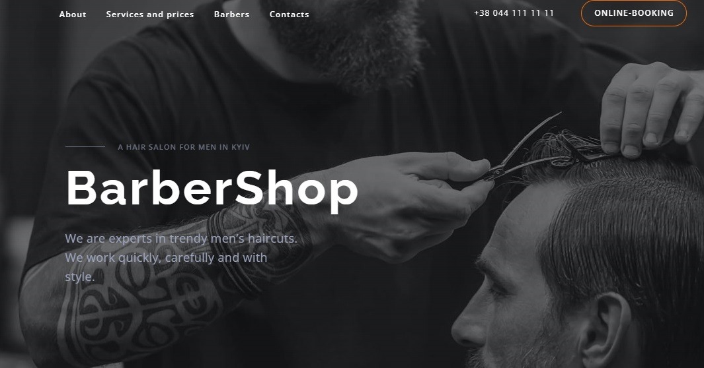

# Barbershop Website README

_Image: Preview of the Barbershop website._

## Overview

This repository contains the source code for a one-page website called
"Barbershop." The site is designed for a barbershop business and features a
header with links to the About, Services and Prices, Barbers, and Contacts
sections. The homepage includes an animated background that automatically
changes colors. The site is fully responsive, adapting to three screen sizes
(448px, 720px, 1200px), with a burger menu replacing the header in the mobile
version. The website includes four sections: About, Services and Prices,
Barbers, and Contacts, each featuring an online booking form. Technologies used
include HTML, Sass, JavaScript, and the Swiper library.

## Getting Started

To view the website, simply open the `index.html` file in your preferred web
browser. The site is designed to be responsive and user-friendly.

## Technologies Used

-   **HTML:** The structure and layout of the website are defined using HTML.
-   **Sass:** Styles are written in Sass, providing a more organized and
    maintainable stylesheet.
-   **JavaScript:** Dynamic features and interactions are implemented using
    JavaScript.
-   **Swiper:** The Swiper library is utilized for creating a responsive slider.

## Sections

1. **About:** Provides information about the barbershop.
2. **Services and Prices:** Details the services offered by the barbershop and
   their corresponding prices.
3. **Barbers:** Introduces the skilled barbers working at the shop.
4. **Contacts:** Includes a contact form for online booking and general
   inquiries.

## Responsive Design

-   The site is optimized for three screen sizes: 448px, 720px, and 1200px.
-   In the mobile version, the header transforms into a burger menu for better
    navigation.

## Acknowledgments

Thank you for your interest in the Barbershop website. I hope you enjoy
exploring the site!
